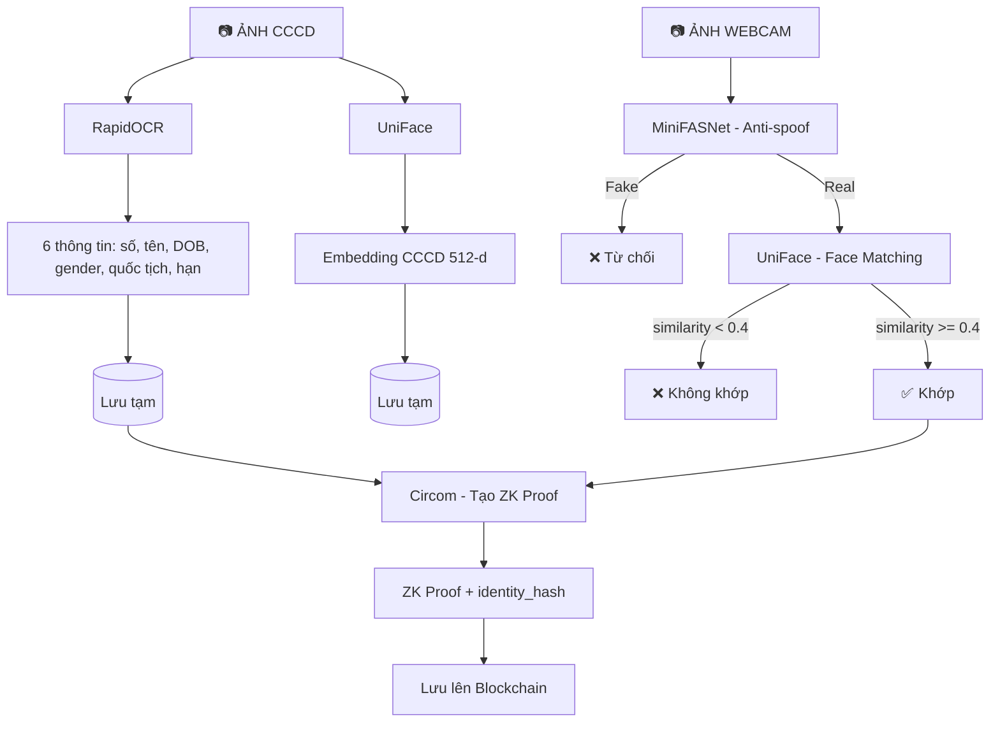

```mermaid
flowchart TD

%% ======== BƯỚC 1: UPLOAD CCCD ========
A[📷 ẢNH CCCD] --> B1[RapidOCR]
A --> B2[UniFace]

B1 --> C1[6 thông tin: số, tên, DOB, gender, quốc tịch, hạn]
B2 --> C2[Embedding CCCD 512-d]

C1 --> SAVE1[(Lưu tạm)]
C2 --> SAVE2[(Lưu tạm)]

%% ======== BƯỚC 2: XÁC MINH WEBCAM ========
W[📷 ẢNH WEBCAM] --> F1[MiniFASNet - Anti-spoof]

F1 --> |Fake| FX[❌ Từ chối]
F1 --> |Real| F2[UniFace - Face Matching]

F2 --> |similarity < 0.4| MX[❌ Không khớp]
F2 --> |similarity >= 0.4| OK[✅ Khớp]

%% ======== BƯỚC 3: TẠO ZK PROOF ========
OK --> ZK[Circom - Tạo ZK Proof]
SAVE1 --> ZK

ZK --> PROOF[ZK Proof + identity_hash]

%% ======== BƯỚC 4: LƯU ON-CHAIN ========
PROOF --> CHAIN[Lưu lên Blockchain]

```
